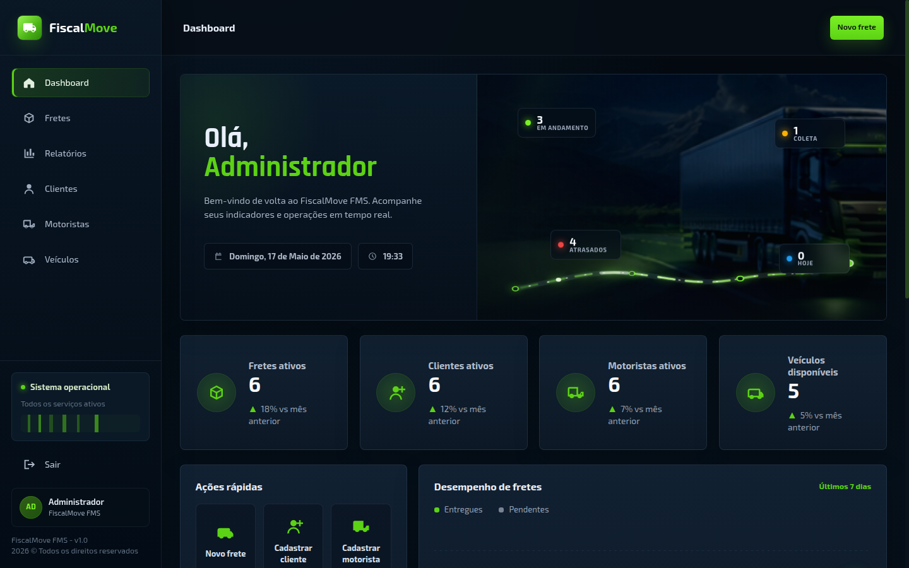

# FiscalMove FMS

Sistema web Java para gestao operacional de fretes, clientes, motoristas,
veiculos, ocorrencias e relatorios, com integracao HTTP para uma API fiscal
externa.

Os dados de exemplo incluidos no projeto sao ficticios. Regras fiscais
detalhadas e memorias de calculo ficam fora deste repositorio; o sistema Java
persiste apenas o resumo fiscal necessario para a operacao.



## Visao Geral

O FiscalMove FMS cobre o fluxo operacional de uma transportadora:

```text
cadastros -> emissao -> acompanhamento -> ocorrencias -> relatorios
```

O sistema mantem a operacao no Java e trata a decisao fiscal por meio de um
servico externo acessado por contrato HTTP. Essa separacao preserva o dominio
operacional no sistema principal e isola regras fiscais em um limite proprio.

## Funcionalidades

- dashboard operacional com indicadores e atalhos;
- cadastro de clientes, motoristas e veiculos;
- validacoes de CPF/CNPJ, CNH, disponibilidade, capacidade e compatibilidade;
- emissao de fretes com validacoes de negocio;
- maquina de estados do frete:
  `EMITIDO -> SAIDA_CONFIRMADA -> EM_TRANSITO -> ENTREGUE | NAO_ENTREGUE`;
- historico de ocorrencias;
- geracao de relatorios PDF com JasperReports;
- integracao backend-to-backend com API fiscal externa.

## Stack

| Area | Tecnologia |
| --- | --- |
| Linguagem | Java 8 |
| Web | Servlets, JSP, JSTL |
| Build | Gradle |
| Servidor local | Gretty com Tomcat 9 |
| Banco | PostgreSQL |
| Pool de conexoes | Apache Commons DBCP2 |
| Relatorios | JasperReports |
| JSON | Gson |
| Senhas | BCrypt |
| Containerizacao | Docker e Docker Compose |

## Modulos

| Modulo | Responsabilidade |
| --- | --- |
| `cliente` | Cadastro, documento fiscal, endereco e logo |
| `motorista` | CPF, CNH, vinculo, status e aptidao operacional |
| `veiculos` | Placa, RNTRC, capacidade, tipo e disponibilidade |
| `frete` | Emissao, validacoes, transicoes e ocorrencias |
| `relatorio` | PDFs operacionais gerados com JasperReports |
| `motorfiscal` | Contrato HTTP com a API fiscal externa |
| `nucleo` | Login, sessao, conexao e utilitarios compartilhados |

## Arquitetura

```text
Usuario
  -> Aplicacao Java
      -> PostgreSQL operacional
      -> API fiscal externa
```

Mais detalhes:

- [Arquitetura](docs/architecture.md)
- [Fluxo operacional](docs/operational-flow.md)

## Execucao Com Docker

1. Crie o arquivo de ambiente:

   ```bash
   cp .env.example .env
   ```

2. Suba a aplicacao e o PostgreSQL:

   ```bash
   docker compose up --build
   ```

3. Acesse:

   ```text
   http://localhost:8080/SISTEMA-FRETES
   ```

Por padrao, o PostgreSQL do Compose fica exposto no host pela porta `5433`,
evitando conflito com instalacoes locais que ja usam `5432`.

Credenciais de demonstracao:

| Perfil | Login | Senha |
| --- | --- | --- |
| Administrador | `admin` | `admin123` |
| Operador | `carlos` | `operador123` |

Para habilitar preview e calculo fiscal, configure `MOTOR_FISCAL_BASE_URL` e
`MOTOR_FISCAL_API_KEY` no `.env`.

## Execucao Local

1. Crie o banco PostgreSQL:

   ```sql
   CREATE DATABASE fiscalmove_fms;
   ```

2. Execute os scripts em ordem:

   ```text
   db/01_schema.sql
   db/02_indexes.sql
   db/03_seed_data.sql
   db/04_migration_regras_operacionais_fiscais.sql
   db/05_migration_cliente_logo.sql
   ```

3. Crie a configuracao local:

   ```bash
   cp src/main/resources/db.properties.example src/main/resources/db.properties
   ```

4. Ajuste as propriedades ou exporte as variaveis equivalentes.

5. Suba a aplicacao:

   ```bash
   ./gradlew appRun
   ```

## Configuracao

| Variavel | Uso |
| --- | --- |
| `DB_URL` | URL JDBC do PostgreSQL |
| `DB_USER` | Usuario do banco |
| `DB_PASSWORD` | Senha do banco |
| `DB_DRIVER` | Driver JDBC, opcional |
| `DB_POOL_MIN` | Minimo de conexoes ociosas |
| `DB_POOL_MAX` | Maximo de conexoes no pool |
| `MOTOR_FISCAL_BASE_URL` | Base URL da API fiscal |
| `MOTOR_FISCAL_API_KEY` | Chave usada no header `X-API-Key` |
| `MOTOR_FISCAL_TIMEOUT_MS` | Timeout HTTP da integracao |

Para execucao local, use como base
[`src/main/resources/db.properties.example`](src/main/resources/db.properties.example).
O arquivo real `db.properties` permanece fora do versionamento.

## Fluxo De Frete

Na emissao, o sistema:

1. valida campos obrigatorios, datas, valores e peso;
2. verifica motorista ativo, CNH valida e ausencia de frete aberto;
3. verifica veiculo disponivel, capacidade e compatibilidade com a CNH;
4. gera o numero do frete dentro da transacao JDBC;
5. persiste a operacao;
6. solicita o resumo fiscal ao servico externo.

## Relatorios

- fretes em aberto;
- romaneio de carga;
- documento individual do frete;
- fretes por cliente;
- ocorrencias por periodo;
- desempenho de motoristas.

## Estrutura

```text
fiscalmove-fms/
|-- db/
|-- docs/
|-- src/main/java/br/com/fiscalmove/
|-- src/main/resources/
|-- src/main/webapp/
|-- Dockerfile
|-- docker-compose.yml
`-- build.gradle
```

## Verificacao

```bash
./gradlew clean test war
docker compose config
```

O workflow de CI executa build e testes em pushes e pull requests para `main`.

## Escopo

- seed com dados ficticios para demonstracao;
- nenhum dado real de cliente, empresa ou operacao;
- integracao fiscal representada por contrato HTTP;
- foco em arquitetura, regras operacionais e fluxo completo de fretes.

## Licenca

Distribuido sob a licenca MIT. Consulte [`LICENSE`](LICENSE).
