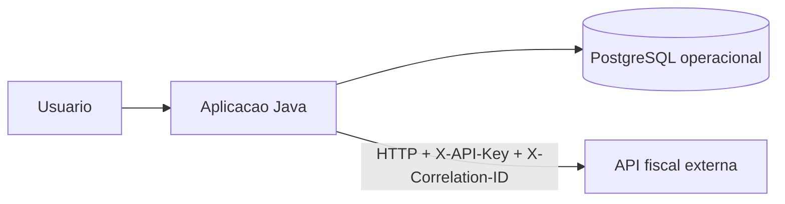

# Arquitetura

## Visao Geral

O FiscalMove FMS separa operacao de fretes e decisao fiscal.



## Responsabilidades

| Componente | Responsabilidade |
| --- | --- |
| Aplicacao Java | Cadastros, emissao, status, ocorrencias e relatorios |
| PostgreSQL operacional | Estado do frete e dados de apoio da operacao |
| API fiscal externa | Regras fiscais, simulacao e memoria de calculo |

## Organizacao Do Codigo

```text
src/main/java/br/com/fiscalmove/
|-- cliente/
|-- frete/
|-- motorista/
|-- motorfiscal/
|-- nucleo/
|-- relatorio/
`-- veiculos/
```

Os controladores recebem requisicoes HTTP, os BOs concentram regras de negocio e
os DAOs isolam SQL. O pacote `motorfiscal` representa o contrato de integracao
com a API externa sem espalhar chamadas HTTP pelo restante do sistema.

## Integracao Fiscal

Fluxo resumido:

```text
Tela de frete
  -> FreteControlador
  -> FreteBO
  -> MotorFiscalClient
  -> API fiscal externa
  -> resumo fiscal persistido no frete
```

O navegador nao chama a API externa diretamente. O token fica no backend Java e
o sistema usa `X-Correlation-ID` para rastreabilidade entre servicos.

## Decisoes De Projeto

- `BigDecimal` e usado em valores monetarios;
- validacoes operacionais ficam nos BOs;
- relatorios sao gerados a partir de templates JRXML versionados;
- configuracao sensivel vem de variaveis de ambiente ou arquivo local ignorado;
- a aplicacao persiste apenas o resumo fiscal necessario ao fluxo operacional.
